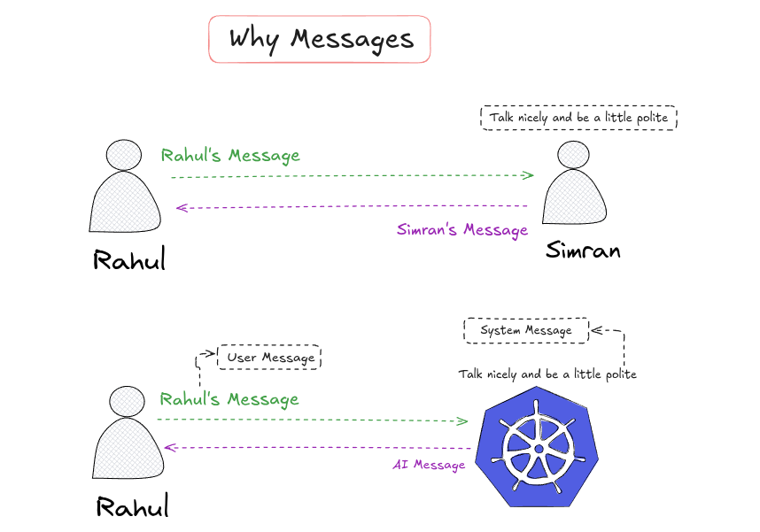

### **1. Agentic-AI and AI-Agent**

#### 1. What is an AI Agent

##### Definition

An AI Agent is a system that can:

- Perceive input
- Make decisions
- Take actions
- Use tools if needed

##### Core Idea

Instead of just generating text, an AI agent can do tasks.

##### Basic Flow

Input → Reason → Decide → Act → Output

##### Example

**User:**  
“Book me a cab for tomorrow 9 AM”

**Agent:**  
- understands intent
- checks location
- calls cab API
- confirms booking

This is an AI Agent.

#### 2. What is Agentic AI

##### Definition

Agentic AI refers to a design paradigm where systems are built using one or more AI agents that act autonomously to achieve goals.

So:  
**AI Agent** = one entity  
**Agentic AI** = system built using agents

##### Key Difference

| Concept          | Meaning                                          |
| ---------------- | ------------------------------------------------ |
| AI Agent         | A single intelligent decision-making unit        |
| Agentic AI       | A full system composed of agents working toward a goal |

##### Types of AI Agents

1. Reactive Agent
   - No memory
   - Just responds to input

2. Tool-Using Agent
   - Uses APIs, DBs, search engines

3. Planning Agent
   - Breaks big tasks into steps

4. Multi-Agent System
   - Multiple agents collaborate

##### Agentic AI Architecture (Modern)

Typical structure:

- Planner Agent
- Executor Agent
- Tool layer
- Memory layer
- Feedback loop

This is what LangGraph is designed for.

##### Where LangChain Fits

LangChain helps build:

- single agents
- tool usage
- chains

But for complex workflows, we use:

→ LangGraph

##### Example Relevant to You (Computer Vision System)

Let’s say your ANPR system runs.

You can build an Agentic AI layer on top:

Agents:

- Detection Agent
  - detects plate
- OCR Agent
  - extracts number
- Validation Agent
  - checks format
- Alert Agent
  - checks blacklist DB
  - triggers alert
- Report Agent
  - logs and sends API response

This is a multi-agent agentic system.

##### Why This Matters

Agentic AI enables:

- automation
- decision-making systems
- autonomous pipelines
- intelligent backends

Exactly what is used in:

- AI copilots
- autonomous assistants
- RAG bots
- Dev agents
- monitoring systems

##### Short Summary

**AI Agent** = one decision-making AI unit  
**Agentic AI** = system of agents working together  
**LangChain** = helps build agents  
**LangGraph** = helps build agentic workflows

---

### **2. What are Tools and why is it necessary for developer to make tools and how they integrate with LLms?**

---

### **3. What is a DAG in Agentic-AI and what is a node/agentin this context?**

---

### **4. Agentic-AI and FrameWorks(langchain) and Building Packages..?**

---

### **5. What is langchain? and the purpose og using langchain? and What is langchain under the Hood?**

We use langchain to call multiple platform SDKs.
We Use langchain SDK and it call different models SDKs.

---

### **6. What and Why are messages? and where are they useful? and What is a System Message?**

---

### ****

---

### ****

---

### ****

---

### ****

---

### ****

---

### ****

---

### ****

---

### ** *

---

### ****

---

### ****

---

### ** *

---

### ****

---

### ****

---

### ****

---

### ** *

---

### ****

---

### ****

---

### ** *

---

### ****

---

### ****

---