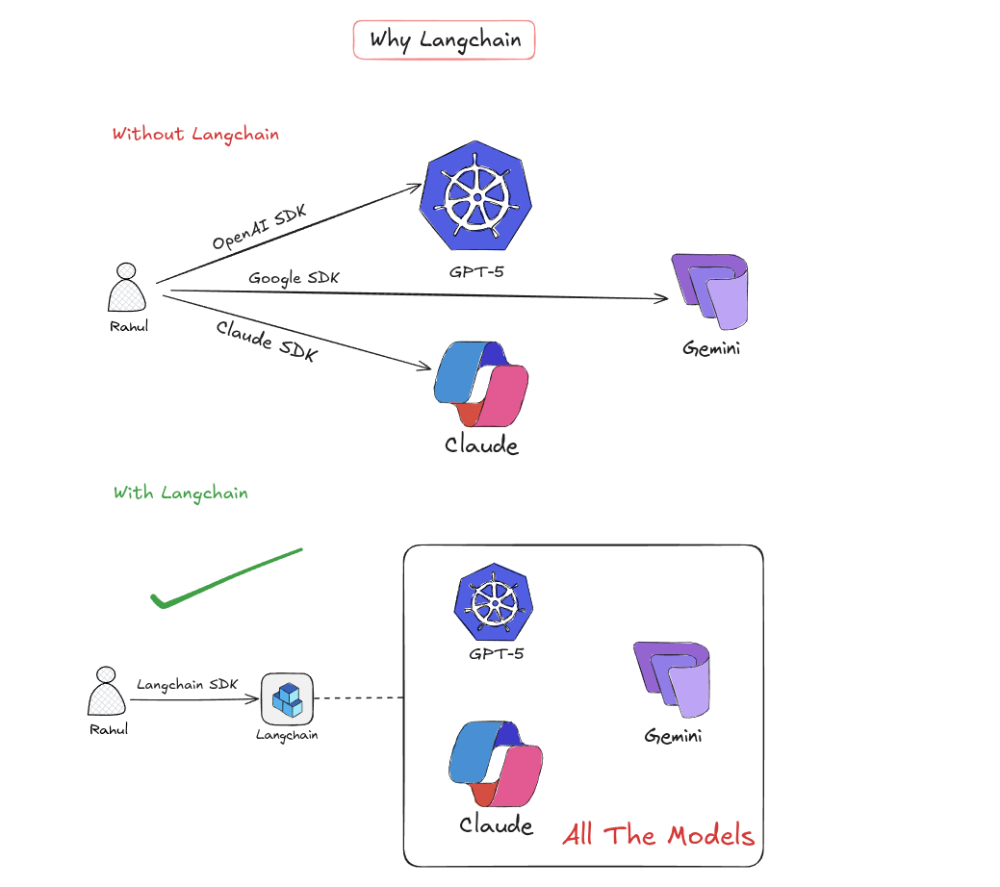

### **1. Agentic-AI and AI-Agent**

---

### **2. What are Tools and why is it necessary for developer to make tools and how they integrate with LLms?**

---

### **3. What is a DAG in Agentic-AI and what is a node/agentin this context?**

---

### **4. Agentic-AI and FrameWorks(langchain) and Building Packages..?**

---

### **5. What is langchain? and the purpose og using langchain? and What is langchain under the Hood?**

We use langchain to call multiple platform SDKs.
We Use langchain SDK and it call different models SDKs.

---

### **6. **

---

### ****

---

### ****

---

### ****

---

### ****

---

### ****

---

### ****

---

### ****

---

### ** *

---

### ****

---

### ****

---

### ** *

---

### ****

---

### ****

---

### ****

---

### ** *

---

### ****

---

### ****

---

### ** *

---

### ****

---

### ****

---