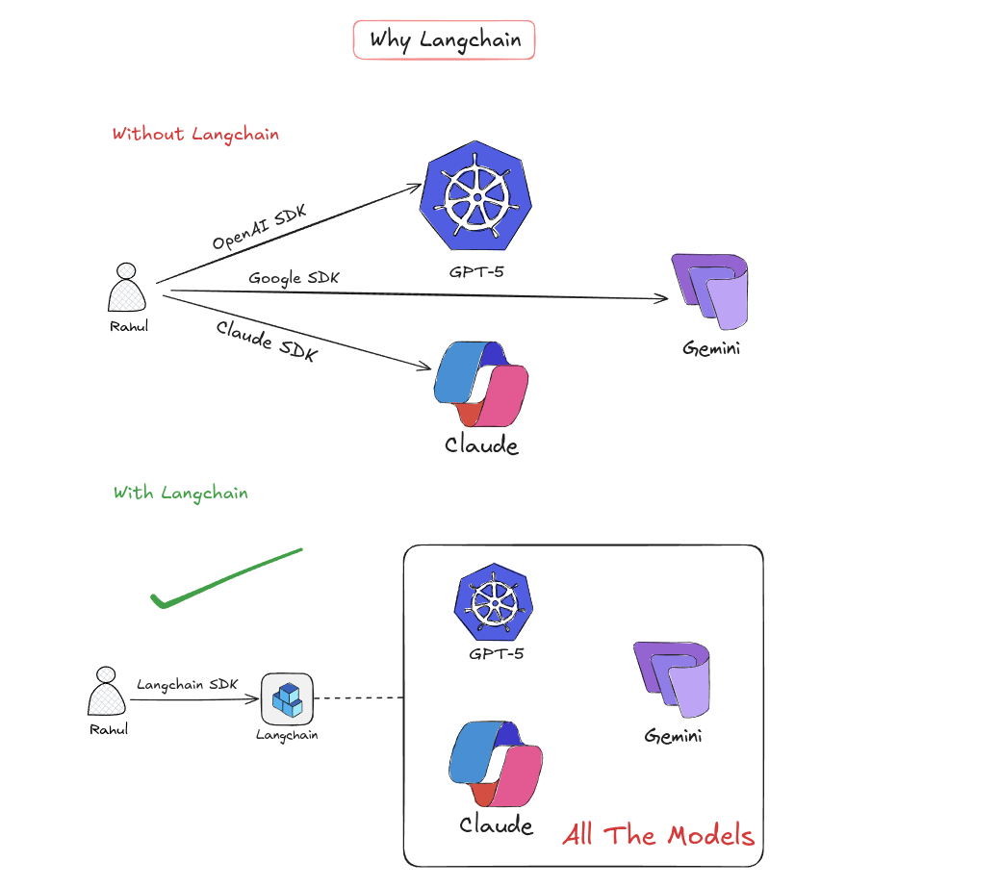
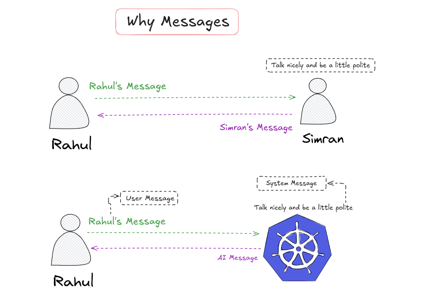

### **1. Agentic-AI and AI-Agent**

#### 1. What is an AI Agent

##### Definition

An AI Agent is a system that can:

- Perceive input
- Make decisions
- Take actions
- Use tools if needed

##### Core Idea

Instead of just generating text, an AI agent can do tasks.

##### Basic Flow

Input → Reason → Decide → Act → Output

##### Example

**User:**  
“Book me a cab for tomorrow 9 AM”

**Agent:**  
- understands intent
- checks location
- calls cab API
- confirms booking

This is an AI Agent.

#### 2. What is Agentic AI

##### Definition

Agentic AI refers to a design paradigm where systems are built using one or more AI agents that act autonomously to achieve goals.

So:  
**AI Agent** = one entity  
**Agentic AI** = system built using agents

##### Key Difference

| Concept          | Meaning                                          |
| ---------------- | ------------------------------------------------ |
| AI Agent         | A single intelligent decision-making unit        |
| Agentic AI       | A full system composed of agents working toward a goal |

##### Types of AI Agents

1. Reactive Agent
   - No memory
   - Just responds to input

2. Tool-Using Agent
   - Uses APIs, DBs, search engines

3. Planning Agent
   - Breaks big tasks into steps

4. Multi-Agent System
   - Multiple agents collaborate

##### Agentic AI Architecture (Modern)

Typical structure:

- Planner Agent
- Executor Agent
- Tool layer
- Memory layer
- Feedback loop

This is what LangGraph is designed for.

##### Where LangChain Fits

LangChain helps build:

- single agents
- tool usage
- chains

But for complex workflows, we use:

→ LangGraph

##### Example Relevant to You (Computer Vision System)

Let’s say your ANPR system runs.

You can build an Agentic AI layer on top:

Agents:

- Detection Agent
  - detects plate
- OCR Agent
  - extracts number
- Validation Agent
  - checks format
- Alert Agent
  - checks blacklist DB
  - triggers alert
- Report Agent
  - logs and sends API response

This is a multi-agent agentic system.

##### Why This Matters

Agentic AI enables:

- automation
- decision-making systems
- autonomous pipelines
- intelligent backends

Exactly what is used in:

- AI copilots
- autonomous assistants
- RAG bots
- Dev agents
- monitoring systems

##### Short Summary

**AI Agent** = one decision-making AI unit  
**Agentic AI** = system of agents working together  
**LangChain** = helps build agents  
**LangGraph** = helps build agentic workflows

---

### **2. What are Tools and why is it necessary for developer to make tools and how they integrate with LLms?**

---

### **3. What is a DAG in Agentic-AI and what is a node/agentin this context?**

---

### **4. Agentic-AI and FrameWorks(langchain) and Building Packages..?**

---

### **5. What is langchain? and the purpose og using langchain? and What is langchain under the Hood?**

We use langchain to call multiple platform SDKs.
We Use langchain SDK and it call different models SDKs.




---

### **6. What and Why are messages? and where are they useful? and What is a System Message?**


---

### **7. What are prmpts and what is prompt Engineering? Why use prompts instead of messages?**

---

### **8. What is Structured outputs?, what is pydantic? and How is it useful in this context?**

---

### **9. What are Chains? How is it similar to Pipwlinws?**

---

### **10. What are Linear and Paralell Chains?**

---

### **11. What is Runnable and Runnable Lambda?**

### What is a Runnable in LangChain

A Runnable is any object that can receive input, process it, and produce output using a common interface.

In LangChain, every runnable supports methods like:

- `invoke()` → run once
- `batch()` → run multiple inputs
- `stream()` → stream outputs

So a Runnable is basically a standard execution unit in LangChain pipelines.

Think of it as:

Input → Runnable → Output

#### Examples of things that are Runnables in LangChain:

- PromptTemplate
- LLM models
- Output parsers
- Chains
- Custom functions

#### Example Runnable (LLM)

```python
response = llm.invoke("What is Earth?")
```

Here:

`llm` is a Runnable.

It receives input and returns output.

#### Example Runnable (Prompt)

```python
prompt_template.invoke({"input": "Hello"})
```

Here:

`prompt_template` is also a Runnable.

### Why LangChain Uses the Runnable Concept

LangChain treats everything as a Runnable so that components can be easily connected.

#### Example pipeline:

Prompt → LLM → Parser

Each component is a runnable.

That is why you can write:

```plaintext
prompt | llm | parser
```

This works because all three objects are Runnable objects.

### What is RunnableLambda

RunnableLambda is a way to convert a normal Python function into a Runnable.

Normally, Python functions are not LangChain runnables.

#### Example normal function:

```python
def dictionary_maker(text):
    return {"text": text}
```

This function cannot be used directly inside a chain.

So LangChain provides:

`RunnableLambda`

which wraps the function.

#### Example

```python
dictionary_maker_runnable = RunnableLambda(dictionary_maker)
```

Now this function becomes a Runnable and can be used inside chains.

### Example Pipeline With RunnableLambda

```python
chain = (
    prompt_template
    | llm
    | parser
    | dictionary_maker_runnable
)
```

#### Pipeline flow:

Input  
↓  
PromptTemplate  
↓  
LLM  
↓  
Parser  
↓  
Custom Python Function  

The custom function now behaves like any other LangChain component.

### Visual Explanation

Normal Python function:

`text → dictionary_maker() → dict`

With RunnableLambda:

`text → RunnableLambda(dictionary_maker) → dict`

Now it fits inside LangChain pipelines.

### Example Code

```python
from langchain_core.runnables import RunnableLambda

def add_prefix(text: str):
    return "Prefix: " + text

prefix_runnable = RunnableLambda(add_prefix)

result = prefix_runnable.invoke("Hello")

print(result)
```

Output:

```
Prefix: Hello
```

### Difference Between Runnable and RunnableLambda

| Concept          | Meaning                                           |
|------------------|--------------------------------------------------|
| Runnable         | Base interface for executable components          |
| RunnableLambda   | Wrapper that converts a Python function into a Runnable |

### Why RunnableLambda is Important

It allows you to insert custom logic inside LLM pipelines.

#### Example uses:

- Data formatting
- Validation
- API calls
- Retrieval
- Pre/Post processing

#### Example real pipeline:

User Query  
↓  
Retriever  
↓  
LLM  
↓  
Custom Processing Function  
↓  
Final Response  

**Key Idea**

Runnable = executable component

RunnableLambda = convert Python function → runnable component

---

### **What is Chain as a Runnable? and What is Beautification?**

---

### ****

---

### ** **

---

### ****

---

### ****

---

### ** **

---

### ****

---

### ****

---

### ****

---

### ** *

---

### ****

---

### ****

---

### ** *

---

### ****

---

### ****

---